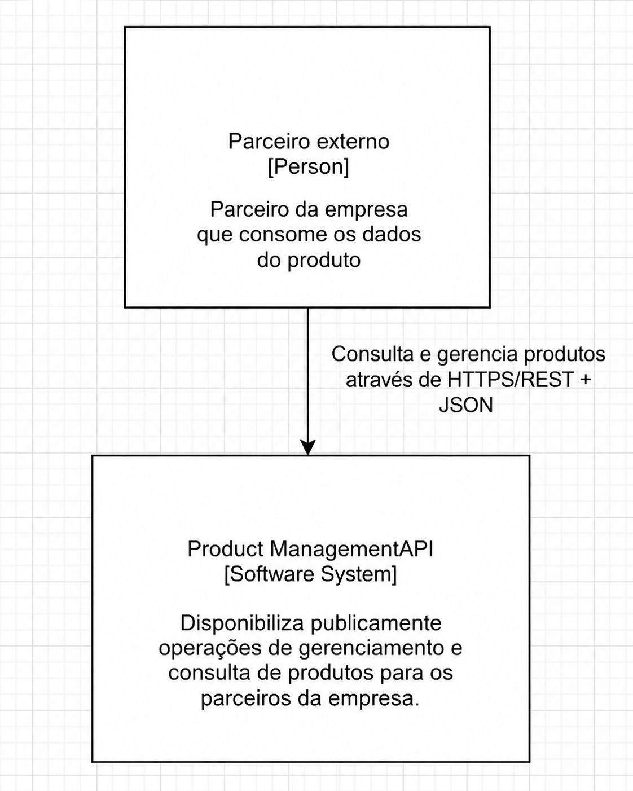
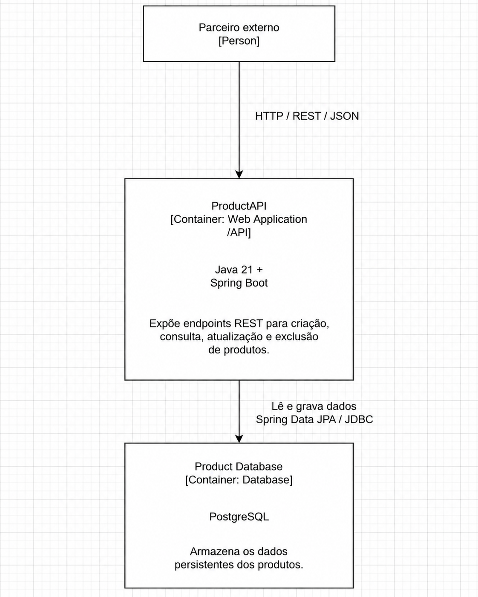
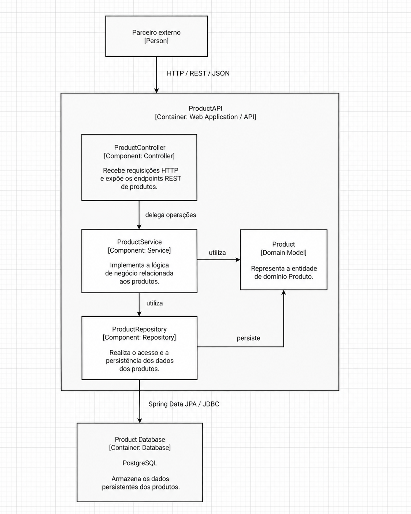
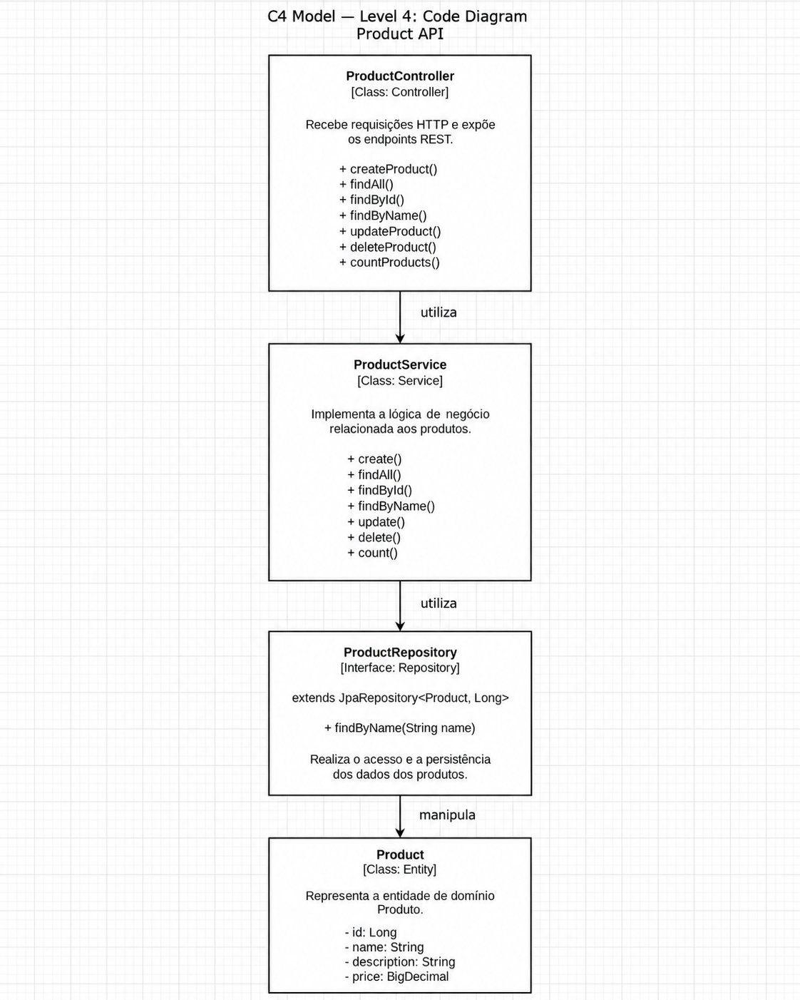

# Desafio Final — Bootcamp Arquiteto(a) de Software

API REST de **Produtos** desenvolvida em **Java 21 + Spring Boot**, estruturada segundo o padrão arquitetural **MVC**, com persistência em **PostgreSQL** e documentação arquitetural utilizando o **C4 Model**.

O projeto foi desenvolvido como entrega do desafio final do Bootcamp **Arquiteto(a) de Software da XP Educação**, com foco em fundamentos de arquitetura de software, requisitos arquiteturais, modelagem, organização em camadas e construção de APIs RESTful.

---

## Objetivo

Disponibilizar uma API REST para gerenciamento de produtos, contemplando as operações solicitadas no desafio:

- Criação de produtos;
- Consulta de todos os produtos;
- Consulta por ID;
- Consulta por nome;
- Atualização;
- Exclusão;
- Contagem total de registros.

Além da implementação, o projeto documenta a arquitetura utilizando os níveis **C1, C2, C3 e C4 do C4 Model**.

---

## Stack e decisões principais

| Item | Escolha |
| --- | --- |
| Linguagem | Java 21 |
| Framework | Spring Boot |
| API | REST / JSON |
| Arquitetura | MVC / arquitetura em camadas |
| Persistência | Spring Data JPA |
| Banco de dados | PostgreSQL 16 |
| Build | Maven |
| Infraestrutura local | Docker Compose |
| Modelagem arquitetural | C4 Model |

A aplicação mantém as responsabilidades separadas entre **Controller**, **Service**, **Repository** e **Model**, evitando concentrar regras de negócio ou persistência na camada HTTP.

---

## Arquitetura

O projeto utiliza o **C4 Model** para representar a solução em diferentes níveis de abstração.

### C1 — System Context

Apresenta a visão mais ampla do sistema: um **parceiro externo** consome a Product Management API através de HTTP/REST utilizando JSON.



---

### C2 — Container Diagram

Detalha os principais containers da solução:

- **Product API** — aplicação Java 21 + Spring Boot responsável pelos endpoints REST;
- **Product Database** — PostgreSQL responsável pela persistência dos produtos.



---

### C3 — Component Diagram

Detalha os principais componentes internos da Product API e suas responsabilidades:

- **ProductController** — recebe as requisições HTTP e expõe os endpoints REST;
- **ProductService** — concentra a lógica de negócio;
- **ProductRepository** — abstrai o acesso e a persistência dos dados;
- **Product** — representa a entidade do domínio.



---

### C4 — Code Diagram

Apresenta a materialização dos componentes arquiteturais nas principais classes e interfaces do projeto.



---

## Fluxo de uma requisição

De forma simplificada, uma requisição percorre a aplicação da seguinte maneira:

```text
Parceiro externo
      |
      | HTTP / REST / JSON
      v
ProductController
      |
      | delega a operação
      v
ProductService
      |
      | utiliza
      v
ProductRepository
      |
      | Spring Data JPA
      v
PostgreSQL
```

O `ProductController` atua como ponto de entrada HTTP.  
O `ProductService` concentra as operações e regras de negócio.  
O `ProductRepository` realiza o acesso aos dados utilizando Spring Data JPA.  
A entidade `Product` representa o modelo persistido no PostgreSQL.

---

## Estrutura do projeto

A organização segue a separação de responsabilidades proposta pelo padrão MVC e pelo enunciado do desafio.

```text
src/
├── main/
│   ├── java/
│   │   └── ...
│   │       ├── controller/
│   │       │   └── ProductController.java
│   │       ├── model/
│   │       │   └── Product.java
│   │       ├── repository/
│   │       │   └── ProductRepository.java
│   │       ├── service/
│   │       │   └── ProductService.java
│   │       └── ...Application.java
│   │
│   └── resources/
│       └── application.yaml
│
├── test/
│   └── java/
│
├── c1.png
├── c2.png
├── c3.png
├── c4.png
├── docker-compose.yml
├── pom.xml
└── README.md
```

> A representação acima destaca a organização arquitetural do projeto. O pacote base pode variar de acordo com a estrutura Java utilizada na implementação.

---

## Responsabilidade dos componentes

| Componente | Responsabilidade |
| --- | --- |
| `ProductController` | Receber requisições HTTP, mapear endpoints REST e delegar operações para o Service |
| `ProductService` | Implementar e coordenar as regras e operações do domínio de produtos |
| `ProductRepository` | Abstrair o acesso ao banco de dados utilizando Spring Data JPA |
| `Product` | Representar a entidade de domínio persistida pela aplicação |
| PostgreSQL | Armazenar os dados dos produtos de forma persistente |

---

## Persistência

Embora o banco de dados seja opcional no enunciado do desafio, este projeto implementa persistência utilizando **PostgreSQL**, executado localmente através do Docker Compose.

Configuração utilizada:

```yaml
POSTGRES_DB: productdb
POSTGRES_USER: productuser
POSTGRES_PASSWORD: productpass
```

A aplicação se conecta ao banco através de:

```text
jdbc:postgresql://localhost:5432/productdb
```

O Hibernate está configurado com:

```text
ddl-auto: update
```

permitindo a criação e atualização automática da estrutura necessária para as entidades durante a execução local.

---

## Executando o projeto

### Pré-requisitos

- Java 21;
- Docker;
- Docker Compose;
- Maven ou Maven Wrapper.

### 1. Subir o PostgreSQL

Na raiz do projeto:

```bash
docker compose up -d
```

O PostgreSQL ficará disponível em:

```text
localhost:5432
```

### 2. Executar a aplicação

Linux/macOS:

```bash
./mvnw spring-boot:run
```

Windows:

```powershell
mvnw.cmd spring-boot:run
```

---

## Operações da API

A API foi projetada para contemplar todas as funcionalidades obrigatórias do desafio:

| Operação | Objetivo |
| --- | --- |
| Create | Criar um produto |
| Find All | Retornar todos os produtos |
| Find By ID | Retornar um produto pelo ID |
| Find By Name | Consultar produtos pelo nome |
| Update | Atualizar um produto existente |
| Delete | Excluir um produto |
| Count | Retornar a quantidade total de produtos |

---

## Checklist dos requisitos do desafio

### 1. API REST

- [x] Domínio escolhido: **Produto**;
- [x] API REST utilizando Java + Spring Boot;
- [x] Organização segundo o padrão MVC;
- [x] Persistência utilizando PostgreSQL.

### 2. Funcionalidades

- [x] Create;
- [x] Read;
- [x] Update;
- [x] Delete;
- [x] Count;
- [x] Find All;
- [x] Find By ID;
- [x] Find By Name.

### 3. Arquitetura e documentação

- [x] C1 — System Context;
- [x] C2 — Container Diagram;
- [x] C3 — Component Diagram;
- [x] C4 — Code Diagram;
- [x] Separação entre Controller, Service, Repository e Model;
- [x] Estrutura do projeto documentada;
- [x] Responsabilidades dos principais componentes descritas.

### 4. Itens opcionais

- [x] Código-fonte disponibilizado no GitHub;
- [x] Persistência funcional com PostgreSQL;
- [x] Ambiente de banco reproduzível com Docker Compose.

---

## Relação entre os níveis C4

```text
C1 — Context
Parceiro externo
        |
        v
Product Management API


C2 — Containers
Parceiro externo
        |
        v
Product API
        |
        v
PostgreSQL


C3 — Components
ProductController
        |
        v
ProductService
        |
        v
ProductRepository
        |
        v
PostgreSQL

     + Product


C4 — Code
ProductController.java
        |
        v
ProductService.java
        |
        v
ProductRepository.java
        |
        v
Product.java
```

Cada nível aumenta o grau de detalhamento da solução: do contexto de negócio até as principais estruturas que compõem o código.

---

## Resumo dos entregáveis

1. **Arquitetura do software** documentada utilizando C4 Model;
2. **C1, C2, C3 e C4** disponibilizados no repositório;
3. **Estrutura MVC** com separação de responsabilidades;
4. **API REST** implementada em Java + Spring Boot;
5. **Persistência PostgreSQL** utilizando Spring Data JPA;
6. **Docker Compose** para execução local do banco de dados;
7. Código-fonte versionado no GitHub.

---

## Autor

**Felipe Matheus**

Projeto desenvolvido como desafio final do Bootcamp **Arquiteto(a) de Software — XP Educação**.
